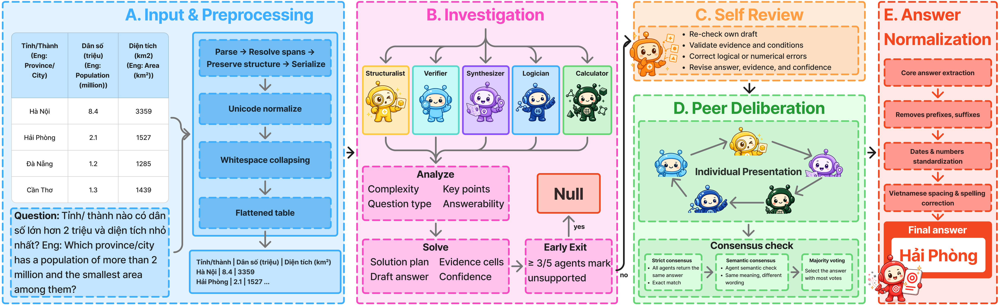

# ViPanelTR: A Multi-Agent Framework for Vietnamese Table Question Answering

ViPanelTR is a role-specialized multi-agent framework for Vietnamese table
question answering. It coordinates structural analysis, evidence verification,
answer synthesis, logical reasoning, and numerical reasoning through an early
answerability gate, bounded self-review, peer deliberation, consensus, and
answer normalization.

> **MAPR 2026:** The ViPanelTR paper has been accepted at the 2026
> International Conference on Multimedia Analysis and Pattern Recognition
> (MAPR 2026). See the
> [official list of accepted papers](https://mapr.uit.edu.vn/list-accepted-papers-mapr-2026)
> and [read the paper](docs/paper.pdf).

## Architecture



The framework contains five role-conditioned agents:

- **Structuralist** reconstructs table structure and relevant regions.
- **Verifier** checks whether candidate claims are supported by table evidence.
- **Synthesizer** integrates findings into a candidate answer.
- **Logician** resolves constraints, comparisons, and logical conditions.
- **Calculator** handles numerical operations and validates calculations.

Each agent first investigates independently. The framework can return `NULL`
early when at least three of five agents identify the question as unsupported.
Otherwise, the agents self-review their drafts, deliberate with their peers,
reach consensus, and normalize the final Vietnamese answer.

## Results

ViPanelTR is evaluated on the official Open-ViTabQA test set using F1, Exact
Match (EM), ROUGE-1 (R1), and METEOR (MET). The complete overall results from
Table I of the paper are reproduced below.

<table>
  <thead>
    <tr>
      <th>Category</th>
      <th>Model</th>
      <th align="right">F1</th>
      <th align="right">EM</th>
      <th align="right">R1</th>
      <th align="right">MET</th>
    </tr>
  </thead>
  <tbody>
    <tr>
      <td rowspan="8">Prompt-based</td>
      <td>LLaMA 2</td><td align="right">4.20</td><td align="right">6.00</td><td align="right">8.80</td><td align="right">5.80</td>
    </tr>
    <tr><td>Mistral 7B v0.3</td><td align="right">34.90</td><td align="right">35.00</td><td align="right">44.80</td><td align="right">32.80</td></tr>
    <tr><td>Mistral Nemo 2407</td><td align="right">35.50</td><td align="right">35.60</td><td align="right">45.20</td><td align="right">33.50</td></tr>
    <tr><td>LLaMA 3.1 8B</td><td align="right">56.44</td><td align="right">35.38</td><td align="right">45.54</td><td align="right">42.89</td></tr>
    <tr><td>Gemini 1.5 Pro</td><td align="right">59.80</td><td align="right">60.80</td><td align="right">71.90</td><td align="right">49.80</td></tr>
    <tr><td>Gemini 2.0 Flash Exp.</td><td align="right">60.50</td><td align="right">60.20</td><td align="right">70.10</td><td align="right">50.00</td></tr>
    <tr><td>GPT-4o mini</td><td align="right">64.57</td><td align="right">42.44</td><td align="right">55.64</td><td align="right">53.17</td></tr>
    <tr><td>Qwen3 8B</td><td align="right">62.58</td><td align="right">40.46</td><td align="right">56.62</td><td align="right">51.98</td></tr>
    <tr>
      <td rowspan="8">Fine-tuned</td>
      <td>LLaMA 2</td><td align="right">5.69</td><td align="right">7.85</td><td align="right">9.58</td><td align="right">6.42</td>
    </tr>
    <tr><td>TAPAS-Base</td><td align="right">30.62</td><td align="right">30.29</td><td align="right">41.10</td><td align="right">28.27</td></tr>
    <tr><td>TAPAS-Large</td><td align="right">31.56</td><td align="right">31.44</td><td align="right">40.02</td><td align="right">27.96</td></tr>
    <tr><td>LLaMA 3.1</td><td align="right">37.73</td><td align="right">36.89</td><td align="right">51.17</td><td align="right">38.54</td></tr>
    <tr><td>Mistral 7B v0.3</td><td align="right">41.28</td><td align="right">41.83</td><td align="right">50.76</td><td align="right">37.08</td></tr>
    <tr><td>ViT5-Base</td><td align="right">42.35</td><td align="right">42.24</td><td align="right">50.35</td><td align="right">36.81</td></tr>
    <tr><td>Mistral Nemo 2407</td><td align="right">43.11</td><td align="right">42.14</td><td align="right">53.71</td><td align="right">40.38</td></tr>
    <tr><td>ViT5-Large</td><td align="right">45.22</td><td align="right">45.13</td><td align="right">51.87</td><td align="right">37.12</td></tr>
    <tr>
      <td rowspan="2">Non-LLM baselines</td>
      <td>RGCN-RCI</td><td align="right">18.12</td><td align="right">17.70</td><td align="right">23.24</td><td align="right">16.71</td>
    </tr>
    <tr><td>KorWikiTQ</td><td align="right">46.00</td><td align="right">46.00</td><td align="right">52.90</td><td align="right">37.80</td></tr>
    <tr>
      <td rowspan="2">Multi-agent systems</td>
      <td>CoAgt</td><td align="right">68.87</td><td align="right">32.36</td><td align="right">45.32</td><td align="right">46.89</td>
    </tr>
    <tr><td>CoQ</td><td align="right">73.20</td><td align="right">57.86</td><td align="right">66.36</td><td align="right">67.20</td></tr>
    <tr>
      <td rowspan="3"><strong>ViPanelTR (Ours)</strong></td>
      <td><strong>LLaMA 3.1 8B</strong></td><td align="right"><strong>62.23</strong></td><td align="right"><strong>40.02</strong></td><td align="right"><strong>50.92</strong></td><td align="right"><strong>48.00</strong></td>
    </tr>
    <tr><td><strong>Qwen3 8B</strong></td><td align="right"><strong>80.06</strong></td><td align="right"><strong>64.72</strong></td><td align="right"><strong>74.94</strong></td><td align="right"><strong>72.12</strong></td></tr>
    <tr><td><strong>GPT-4o mini</strong></td><td align="right"><strong>80.66</strong></td><td align="right"><strong>65.52</strong></td><td align="right"><strong>76.01</strong></td><td align="right"><strong>73.36</strong></td></tr>
  </tbody>
</table>

### Results at a glance

- **Best overall performance:** ViPanelTR with GPT-4o mini reaches **80.66
  F1**, **65.52 EM**, **76.01 ROUGE-1**, and **73.36 METEOR**.
- **Matched-backbone gains:** ViPanelTR improves F1 from 64.57 to 80.66 on
  GPT-4o mini (**+16.09**), from 62.58 to 80.06 on Qwen3 8B (**+17.48**), and
  from 56.44 to 62.23 on LLaMA 3.1 8B (**+5.79**).
- **Multi-agent comparison:** On GPT-4o mini, ViPanelTR exceeds CoAgt by 11.79
  F1 and CoQ by 7.46 F1. It also leads CoQ by 7.66 EM, 9.65 ROUGE-1, and 6.16
  METEOR.
- **Reasoning-intensive questions:** The largest consistent improvements occur
  on Yes/No, Calculate, and Multi-conditions questions.
- **Table robustness:** Improvements hold across normal, merged-header, and
  merged-value tables for all three ViPanelTR backbones.
- **Answerability and normalization:** The answerability gate improves
  unsupported-question detection, while answer normalization raises EM by
  11.39 points on GPT-4o mini and 6.55 points on Qwen3 8B.

## Repository layout

```text
ViPanelTR/
├── data/
│   └── open_vitabqa/                      # Open-ViTabQA benchmark
│       ├── LICENSE                        # Dataset license
│       ├── README.md                      # Dataset documentation
│       ├── TableQA_guideline.pdf          # Annotation guideline
│       ├── qas_dev.json                   # Development questions
│       ├── qas_test.json                  # Test questions
│       ├── qas_train.json                 # Training questions
│       └── table.json                     # Source tables
├── docs/
│   ├── architecture.md                    # Package boundaries and data flow
│   └── paper.pdf                          # ViPanelTR paper
├── imgs/
│   └── architecture.png                   # Framework architecture
├── outputs/
│   └── .gitkeep                           # Preserves the output directory
├── scripts/
│   ├── answerability_classification_f1.py # Answerability evaluation utility
│   ├── create_subset.py                   # Dataset subset utility
│   ├── metrics_by_table_type.py           # Table-structure metrics utility
│   └── split_qas_json.py                  # Dataset splitting utility
├── src/
│   └── vipaneltr/
│       ├── baseline/                      # Zero-shot comparison pipeline
│       │   ├── utils/
│       │   │   ├── __init__.py
│       │   │   └── llm_retry.py
│       │   ├── __init__.py
│       │   ├── llm_client.py
│       │   ├── prompts.py
│       │   └── run.py
│       ├── data/                          # Data loading and preprocessing
│       │   ├── __init__.py
│       │   ├── loader.py
│       │   ├── normalizer.py
│       │   ├── parser.py
│       │   ├── representation.py
│       │   ├── run.py
│       │   └── validation.py
│       ├── evaluation/                    # Metrics and grouped analyses
│       │   ├── __init__.py
│       │   ├── answerability_f1.py
│       │   ├── contracts.py
│       │   ├── cost.py
│       │   ├── evaluator.py
│       │   ├── exact_match.py
│       │   ├── exceptions.py
│       │   ├── f1.py
│       │   ├── io.py
│       │   ├── meteor.py
│       │   ├── metrics_by_table_type.py
│       │   ├── normalization.py
│       │   ├── rouge1.py
│       │   ├── rouge1_by_hint.py
│       │   └── run.py
│       ├── system/                        # Multi-agent reasoning framework
│       │   ├── agents/
│       │   │   ├── __init__.py
│       │   │   ├── base_agent.py
│       │   │   └── llm_client.py
│       │   ├── core/
│       │   │   ├── __init__.py
│       │   │   ├── answer_formatter.py
│       │   │   ├── investigation.py
│       │   │   ├── orchestrator.py
│       │   │   ├── peer_review.py
│       │   │   └── self_review.py
│       │   ├── prompts/
│       │   │   ├── __init__.py
│       │   │   ├── investigation.py
│       │   │   ├── persona_lenses.py
│       │   │   ├── prompt_router.py
│       │   │   ├── self_review.py
│       │   │   └── semantic_consensus.py
│       │   └── __init__.py
│       ├── utils/                         # Shared runtime utilities
│       │   ├── __init__.py
│       │   ├── artifacts.py
│       │   ├── json_parser.py
│       │   ├── llm_retry.py
│       │   ├── logging.py
│       │   ├── question_detector.py
│       │   └── trace.py
│       ├── __init__.py
│       ├── cli.py                         # Command-line interface
│       ├── config.py                      # Configuration loading
│       └── paths.py                       # Repository path resolution
├── tests/
│   ├── integration/
│   │   ├── test_cli.py
│   │   ├── test_scripts.py
│   │   └── test_standalone.py
│   └── unit/
│       ├── test_baseline.py
│       ├── test_cli_credentials.py
│       ├── test_data_validation.py
│       ├── test_evaluation.py
│       ├── test_package_contract.py
│       └── test_usage_tracking.py
├── .env.example                          # Environment-variable template
├── .gitignore
├── LICENSE                               # ViPanelTR source-code license
├── README.md                             # Project documentation
└── pyproject.toml                        # Package metadata and dependencies
```

See [docs/architecture.md](docs/architecture.md) for the package boundaries and
data flow.

## Installation

Python 3.10 or newer is required. From the repository root:

```powershell
python -m pip install -e ".[dev]"
```

Install the optional evaluation dependencies with:

```powershell
python -m pip install -e ".[dev,eval]"
```

## Configuration

Copy `.env.example` to `.env` for local use and set only the providers you
need. Never commit `.env`.

Supported variables include `OPENAI_API_KEY`, `OPENROUTER_API_KEY`,
`GOOGLE_API_KEY`, `ANTHROPIC_API_KEY`, `FPT_AI_MARKETPLACE`, and
`SEALION_API_KEY`. CLI arguments override YAML configuration values.

Real inference sends table and question content to the selected model provider
and may incur usage charges. Data preparation, evaluation, and automated tests
do not call paid APIs.

## Usage

### Validate the dataset

```powershell
vipaneltr prepare-data
```

This command checks the four required JSON files, duplicate identifiers, and
every QA-to-table reference before inference begins.

### Run ViPanelTR inference

```powershell
vipaneltr infer `
  --qas data/open_vitabqa/qas_test.json `
  --model openai/gpt-4o-mini `
  --run-id gpt4o-mini `
  --n 5
```

Artifacts are written below `outputs/<run-id>/`, including results, metadata,
configuration, token totals, and provider-reported or estimated cost.

### Evaluate predictions

```powershell
vipaneltr evaluate `
  --preds outputs/gpt4o-mini/results.json `
  --qas data/open_vitabqa/qas_test.json `
  --output-dir outputs/gpt4o-mini/eval
```

The detailed report is written to
`outputs/gpt4o-mini/eval/evaluation.json`.

### Run the zero-shot baseline

```powershell
vipaneltr baseline `
  --qas data/open_vitabqa/qas_test.json `
  --tables data/open_vitabqa/table.json `
  --model openai/gpt-4o-mini `
  --n 5
```

The baseline uses the same data representation and usage-accounting policy as
the multi-agent system.

## Development and testing

```powershell
python -m pytest
python -m compileall -q src/vipaneltr
```

Tests use small local fixtures and offline model paths, so provider credentials
are not required.

## Paper citation

```bibtex
@inproceedings{nguyen2026vipaneltr,
  author    = {Nguyen, Dinh Khoi and Vo, Tuan Kiet and Dang, Van Thin},
  title     = {ViPanelTR: A Multi-Agent Framework for Vietnamese Table Question Answering},
  booktitle = {2026 International Conference on Multimedia Analysis and Pattern Recognition (MAPR)},
  year      = {2026}
}
```

## Dataset

This repository includes the
[Open-ViTabQA](https://github.com/DuzDao/Open-ViTabQA) benchmark under its MIT
License. When using the dataset, cite:

> Dung Hoang Dao, Ngan Thi-Kim Huynh, Khanh Quoc Tran, and Kiet Van Nguyen.
> “Open-ViTabQA: A novel benchmark for Vietnamese question answering on open
> domain Wikipedia tables.” _Knowledge-Based Systems_ 330 (2025), 114391.
> <https://doi.org/10.1016/j.knosys.2025.114391>

## License

| Component                                    | License and copyright                                                                                               |
| -------------------------------------------- | ------------------------------------------------------------------------------------------------------------------- |
| `src/vipaneltr/`, `scripts/`, and `tests/`   | [MIT License](LICENSE), Copyright © 2026 Nguyen Dinh Khoi                                                           |
| `data/open_vitabqa/`                         | Governed by its [separate MIT License](data/open_vitabqa/LICENSE) and the dataset authors' copyright                |
| `docs/paper.pdf` and `imgs/architecture.png` | Copyright © 2026 Nguyen Dinh Khoi, Vo Tuan Kiet, and Dang Van Thin. All rights reserved unless separately permitted |

The paper and architecture image are research artifacts and are **not** covered
by the source-code MIT License.
